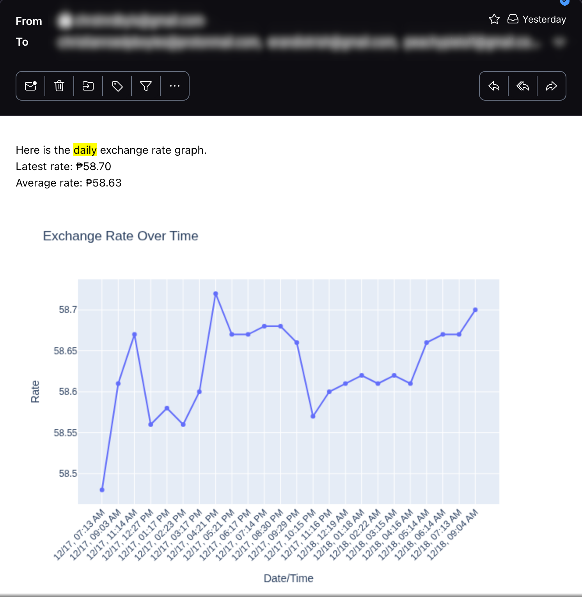

# Exchange Rate Notifier

A Python application that monitors exchange rates (PHP/USD) and sends email notifications when rates exceed configured thresholds. The system tracks rates hourly, stores them in a PostgreSQL database, and provides daily reports with visualizations.



## Features

- **Hourly Rate Monitoring**: Automatically fetches exchange rates and checks against upper/lower thresholds
- **Email Notifications**: Sends alerts when rates exceed configured thresholds
- **Daily Reports**: Generates and emails daily reports with exchange rate graphs
- **Database Storage**: Stores historical exchange rate data in PostgreSQL
- **Visualization**: Creates interactive charts using Plotly

## Requirements

- Python 3.x
- PostgreSQL database
- OpenExchangeRates API account (free tier available)
- Email account for sending notifications

## Installation

1. Clone the repository:
```bash
git clone <repository-url>
cd exchange-rate-notifier
```

2. Install dependencies:
```bash
pip install -r requirements.txt
```

3. Set up environment variables:
```bash
# OpenExchangeRates API
export OPEN_EXCHANGE_RATES_APP_ID="your_app_id"
export OPEN_EXCHANGE_RATES_APP_BACKUP_ID="your_backup_app_id"  # Optional

# PostgreSQL Database
export POSTGRES_USER="your_db_user"
export POSTGRES_PASSWORD="your_db_password"
export POSTGRES_HOST="localhost"
export POSTGRES_PORT="5432"
export POSTGRES_DBNAME="your_db_name"

# Email Configuration
export SENDER_EMAIL="your_email@gmail.com"
export SENDER_PASSWORD="your_email_password"
export RECIPIENT_EMAILS="recipient1@example.com,recipient2@example.com"
```

4. Set up the database:
Create a PostgreSQL table named `rates` with the following schema:
```sql
CREATE TABLE rates (
    id SERIAL PRIMARY KEY,
    rate DECIMAL(10, 2) NOT NULL,
    created_at TIMESTAMP DEFAULT CURRENT_TIMESTAMP
);
```

## Configuration

Edit `constants.py` to customize the monitored currency and thresholds:

```python
CURRENCY = "PHP"           # Currency code to monitor
UPPER_THRESHOLD = 57.8     # Upper threshold for notifications
LOWER_THRESHOLD = 55.5     # Lower threshold for notifications
```

## Usage

### Hourly Rate Check

Run the hourly check script to fetch the current rate and send notifications if thresholds are exceeded:

```bash
python hourly.py
```

This script:
- Fetches the current exchange rate from OpenExchangeRates API
- Stores the rate in the database
- Checks if the rate exceeds upper or lower thresholds
- Sends email notifications if thresholds are exceeded

### Daily Report

Generate and send a daily report with exchange rate visualization:

```bash
python daily.py
```

This script:
- Retrieves the last 24 hours of exchange rate data from the database
- Generates a line chart visualization
- Calculates average and latest rates
- Emails the report with the chart attached

## Development

### Code Formatting

Format code using Black and isort:
```bash
make format
```

### Linting

Check code style:
```bash
make lint
```

### Spell Checking

Check and fix spelling:
```bash
make spell-check
make spell-fix
```

## Dependencies

- `requests` - HTTP library for API calls
- `yagmail` - Email sending library
- `psycopg2-binary` - PostgreSQL adapter
- `plotly` - Interactive visualization library
- `kaleido` - Static image export for Plotly
- `keyring` - Secure credential storage

## License

See [LICENSE](LICENSE) file for details.
